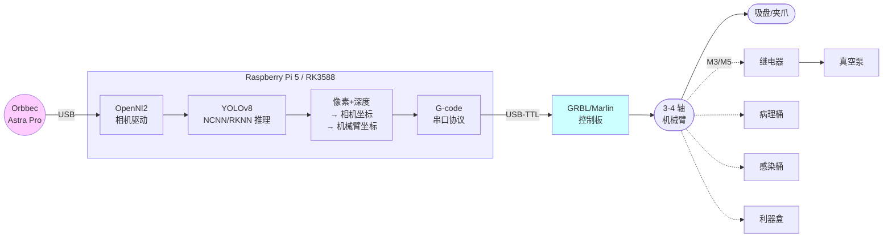

# Medical Waste Sorting Robotic Arm · 医疗废弃物分拣机械臂

[](https://github.com/deafenken/medical-waste-sorter/actions/workflows/ci.yml)

> 用 YOLOv8 + Orbbec 深度相机 + G-code 串口机械臂，把医疗废弃物按照
> "病理性 / 感染性 / 损伤性" 三类自动分拣到对应垃圾桶。
>
> 终端：树莓派（Raspberry Pi 4/5），后续可平滑迁移到 RK3588 NPU。

> 想 5 分钟扫一遍部署全流程？看 [docs/DEPLOY.md](docs/DEPLOY.md)。

---

## 系统架构



工作流程：相机出 RGB-D → YOLO 检测 5 类废弃物 → 单帧 3D 定位 → 仿射变换到
机械臂坐标 → G-code 抓取 → 投放到对应类别的垃圾桶 → 回原点等下一帧。

---

## 功能

- 5 类目标检测：塑料瓶、玻璃瓶、口罩、纱布、注射器（YOLOv8n 微调）
- RGB-D 单帧 3D 定位（深度相机出 z，针孔反投影出 x、y）
- 一次手眼标定，长期使用：50 点 ArUco 标定 + 最小二乘解 4×4 仿射矩阵
- G-code 协议机械臂控制：等 `ok` 回包，避免指令丢失
- 多进程：视觉与机械臂并行，互不阻塞
- **多帧投票 + IoU 跟踪**：连续 N 帧检测到同一物体才触发抓取，削掉偶发误检
- **双阈值（hysteresis）**：低阈值画框、高阈值抓取
- **模型预热**：消除第一帧 1-2 秒冷启动开销
- 后端可插拔：YOLOv8 推理 PyTorch / NCNN / **Hailo-8** / RKNN / ONNX 一键切换
- INT8 量化导出脚本：Pi 上速度 ~2x、RK3588 NPU 必需
- 全配置文件驱动：换硬件不动代码，只动 `config.yaml`

---

## 目录结构

```
medical-waste-sorter/
├── README.md                      <-- 你在这里
├── config.example.yaml            -- 配置模板
├── requirements.txt               -- Python 依赖
├── .gitignore
│
├── src/                           -- 业务逻辑
│   ├── config.py                  -- YAML 配置加载
│   ├── camera.py                  -- 相机抽象（Orbbec / USB）
│   ├── serial_arm.py              -- G-code 串口封装
│   ├── detector.py                -- YOLO 推理（多后端）
│   ├── coords.py                  -- 像素↔相机↔机械臂坐标变换
│   ├── calibration.py             -- 手眼标定主程序
│   ├── calibration_points.py      -- 默认标定轨迹点
│   └── main.py                    -- 主流水线
│
├── tools/                         -- 调试工具
│   ├── port_probe.py              -- 探测机械臂控制板协议
│   ├── test_arm.py                -- 机械臂手动 jog REPL
│   ├── depth_inspect.py           -- 双击图像看 3D 坐标
│   ├── aruco_demo.py              -- 实时 ArUco 检测预览
│   └── export_ncnn.py             -- 一键导出 NCNN 模型
│
├── scripts/
│   └── install_pi.sh              -- 树莓派一键部署
│
├── models/                        -- 模型权重
│   ├── best.pt                    -- 自训 5 类检测模型
│   └── yolov8n.pt                 -- YOLOv8n 通用模型
│
├── save_parms/                    -- 标定结果
│   ├── image_to_arm.npy
│   └── arm_to_image.npy
│
└── docs/
    ├── DEPLOY.md                  -- ⭐ 完整部署流程（从开箱到跑起来）
    ├── HAILO.md                   -- Hailo-8 NPU 部署指南（Pi 5 + Hailo-8 26 TOPS）
    ├── OPTIMIZATION.md            -- 识别模型优化（投票/双阈值/INT8）
    ├── PANTHERA_HT.md             -- Panthera-HT 6DOF 臂适配档案（FDCAN）
    ├── BOM.md                     -- 完整硬件清单
    ├── CALIBRATION.md             -- 手眼标定详细步骤
    ├── RK3588.md                  -- RK3588 NPU 移植指南
    ├── TROUBLESHOOTING.md         -- 常见问题排查
    └── PUBLISH.md                 -- 第一次发到 GitHub 的命令清单
```

---

## 快速开始（树莓派）

### 0. 硬件清单

详见 [docs/BOM.md](docs/BOM.md)。最简版：

| 项 | 推荐 |
|---|---|
| 主控 | Raspberry Pi 5 8GB |
| 相机 | Orbbec Astra Pro Plus（与代码内参一致） |
| 机械臂 | 任意 G-code 协议臂（GRBL / Marlin 固件） |
| 末端 | 气动吸盘 + 5V 继电器 + 真空泵 |
| 标定 | 5cm × 5cm ArUco 7×7 标定卡 |
| 加速（可选） | Hailo-8L 模块或 Coral USB |

### 1. 克隆 & 装系统（uv 管理）

```bash
git clone https://github.com/deafenken/medical-waste-sorter.git
cd medical-waste-sorter

# 一键安装：apt / uv / .venv / pyproject 依赖 / RealSense / 可选 SDK
chmod +x scripts/install_pi.sh
./scripts/install_pi.sh

# 想同时装 Hailo-8 / Panthera SDK / Orbbec 任意组合：
HAILO_SDK=1 PANTHERA_SDK=1 ./scripts/install_pi.sh
```

脚本做了什么：

- 装 apt 依赖（cmake / libusb / opencv 等）
- 把当前用户加 `dialout` 组（串口权限）
- 装 **uv**（如果还没装）
- `uv venv` 创建 `.venv/`，`uv sync` 装核心 Python 依赖
- 装 Intel RealSense（默认，D405 用）
- 可选：`ORBBEC_SDK=1` 编译 OpenNI2 ARM64 + Orbbec udev 规则
- 可选：`HAILO_SDK=1` 装 HailoRT + hailo-platform（要求把 .deb / .whl 文件先放到 `~/hailo/`，详见 [docs/HAILO.md](docs/HAILO.md)）
- 可选：`PANTHERA_SDK=1` 源码编译 Panthera-HT 机械臂 SDK
- 复制 `config.example.yaml` → `config.yaml`
- `best.pt` 导出为 NCNN（用作 fallback 后端）

### 2. 配置

编辑 `config.yaml`，至少改这几项：

```yaml
camera:
  openni_redist_path: /home/pi/OpenNI2/Bin/Arm64-Release/OpenNI2  # 安装脚本会自动填
arm:
  port: /dev/ttyUSB0      # 改成你机械臂的串口（lsusb / dmesg 查）
detector:
  backend: ncnn           # 树莓派强烈推荐
  model_path: models/best_ncnn_model
```

机械臂坐标系下三个垃圾桶的位置、抓取高度也在这个文件里改，
不需要碰 Python 代码。

### 3. 验证设备（顺序很重要）

```bash
source .venv/bin/activate    # 或者用 uv run <command> 不激活也行

# 3.1 串口能通吗？看到 "Grbl" 或 "Marlin" 字样就对了
uv run python tools/port_probe.py --port /dev/ttyUSB0

# 3.2 手动 jog 一下机械臂；执行 home / move / grip
uv run python tools/test_arm.py

# 3.3 相机能出深度图吗？双击图像应该打印 3D 坐标
uv run python tools/depth_inspect.py

# 3.4 打印 ArUco 卡，能否被识别？
uv run python tools/aruco_demo.py
```

任何一步过不去先看 [docs/TROUBLESHOOTING.md](docs/TROUBLESHOOTING.md)。

### 4. 手眼标定

把 5cm 的 ArUco 卡贴在机械臂末端（吸盘正下方，记录偏移），运行：

```bash
python -m src.calibration --force
```

机械臂会自动走 50 个点，每到一处相机拍一张算 ArUco 中心。
程序最后会打印 Sanity Check，**误差应在 5mm 以内**。
详见 [docs/CALIBRATION.md](docs/CALIBRATION.md)。

### 5. 跑分拣

```bash
python -m src.main
```

把废弃物放到工作台，机械臂自动识别 → 抓取 → 投放到对应垃圾桶。
按 `q` 退出预览窗口；`Ctrl+C` 关闭整套系统。

---

## 切换到 Hailo-8 NPU（Pi 5 + Hailo-8 26 TOPS）

Pi 5 + Hailo-8 实测 30+ FPS（YOLOv8n @ 640）。完整流程见
[docs/HAILO.md](docs/HAILO.md)。简版四步：

1. PC（x86_64 Ubuntu 22.04）上把 `best.pt` → `best.onnx` → `best.hef`
   （需 Hailo Dataflow Compiler）
2. Pi 上 `~/hailo/` 放好 HailoRT `.deb` 和 `hailo_platform` `.whl`，
   跑 `HAILO_SDK=1 ./scripts/install_pi.sh`
3. `scp best.hef` 到 Pi 的 `models/` 目录
4. 改 `config.yaml`：`detector.backend: hailo` + `model_path: models/best.hef`

## 切换到 RK3588 NPU（备用平台）

YOLO 在 RK3588 上跑 NPU 比 Pi 5 CPU 快 ~5x。迁移路径：

1. 把 `best.pt` 转成 ONNX（`tools/export_ncnn.py --format onnx`）
2. 用 RKNN-Toolkit 在 PC 上把 ONNX 转成 `best.rknn`
3. 把 `best.rknn` 放到板子的 `models/` 目录
4. 改 `config.yaml`：

```yaml
detector:
  backend: rknn
  model_path: models/best.rknn
```

详细步骤、量化参数和 `RknnDetector.predict()` 的实现见
[docs/RK3588.md](docs/RK3588.md)。

---

## 配置说明

`config.yaml` 完整字段在 `config.example.yaml` 里都有注释。最常改的：

| 字段 | 说明 |
|---|---|
| `camera.backend` | `orbbec`（生产）或 `usb`（无深度相机时仅用于调模型） |
| `camera.openni_redist_path` | OpenNI2 驱动 `.so` 所在目录 |
| `camera.intrinsics` | 你相机的内参；不准就标定 |
| `arm.port` | 机械臂串口设备名 |
| `arm.bins.*` | 三个垃圾桶在机械臂坐标系下的位置 |
| `arm.gripper_close_cmd` / `gripper_open_cmd` | GRBL: `M3` / `M5`；Marlin 可能不同 |
| `detector.backend` | `pytorch` / `ncnn` / `onnx` / `rknn` |
| `detector.conf_threshold` | 越高误检越少，但漏检多 |
| `runtime.show_window` | headless 部署时设 `false` |

---

## 自训模型

`models/best.pt` 是 5 类检测，类名硬编码在 `category_to_bin`。
如果你要识别更多类别，重训后：

1. 把新 `best.pt` 放到 `models/`
2. 重新导出：`python tools/export_ncnn.py models/best.pt`
3. 在 `config.yaml` 的 `detector.category_to_bin` 加映射

类名必须和 `model.names` 严格一致（注意大小写和空格）。

---

## 已知坑

- **深度=0**：物体太近 (<10cm) 或太反光，OpenNI2 返回 0。代码已加阈值过滤
  （`camera.depth_min_mm` / `depth_max_mm`），并对中心像素做 5×5 ROI 中位数滤波。
- **彩色与深度对齐**：默认 `flip_color: true` 假设 Astra 彩色镜头和深度镜头是
  镜像装配。少数 Astra 型号已经做过镜像校准，需要改成 `false`。务必用
  `tools/depth_inspect.py` 验证一遍再做手眼标定。
- **`M3`/`M5` 在不同固件语义不同**：GRBL 是主轴正转/停，Marlin 可能是
  风扇/激光。**第一次接气泵前一定要空转测试**！
- **回零方向**：很多 G-code 臂 `G28` 要先设过限位，否则会撞。务必先用
  `tools/test_arm.py` 手动测过再跑流水线。
- **没有急停**：强烈建议给机械臂加物理急停，或在 `src/main.py` 里
  加一个键盘监听立刻关闭串口。
- **单帧检测无投票**：当前实现一旦检测到目标立即触发抓取。光照抖动或
  桌面纹理偶发误检会导致一次空抓。如需更稳，可在 `vision_worker` 加一个
  N 帧"连续相同类别"窗口再 put。

---

## 贡献

欢迎 issue / PR。代码风格：

- 类型注解 + `logging` 而非 `print`
- 一切硬编码值进 `config.yaml`
- 新加后端实现 `Detector` 或 `Camera` 抽象基类即可

---

## 致谢

模型与流程参考了 Ultralytics YOLOv8、Orbbec OpenNI2、OpenCV ArUco。
